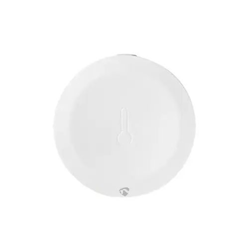

# Laitteet

Tällä sivulla käydään läpi hyviksi ja toimiviksi todettuja laitteita, joita voi käyttää Home Assistantin kanssa.

## Valaistus

### Ikea Tradfri

Ikea Tradfri on edullinen ja toimiva valaistusjärjestelmä, joka on yhteensopiva Home Assistantin kanssa. Tradfrin valaisimet käyttävät Zigbee-protokollaa, joten ne vaativat toimiakseen Zigbee-yhteyttä tukevan sillan. Siltana voi käyttää esimerkiksi Ikea Tradfri Gateway -siltalaitetta tai Zigbee-yhteyttä tukevaa USB-tikkua, kuten Sonoff ZigBee 3.0 USB-Dongle Plus-E(suositeltu).

## Siltalaitteet

### Ikea Tradfri Gateway

Ikea Tradfri Gateway on siltalaite, joka mahdollistaa Ikea Tradfri -valaistusjärjestelmän käytön Home Assistantin kanssa. Gateway on helppo asentaa ja käyttää, ja sen avulla voit hallita Tradfrin valaisimia ja muita laitteita Home Assistantin kautta.

### Sonoff ZigBee 3.0 USB-Dongle Plus-E

Sonoff ZigBee 3.0 USB-Dongle Plus-E on USB-tikku, joka tukee Zigbee-yhteyttä. Tikku on yhteensopiva Home Assistantin kanssa ja se toimii siltana Zigbee-laitteiden ja Home Assistantin välillä. Tikku on helppo asentaa ja käyttää, ja sen avulla voit lisätä Zigbee-laitteita Home Assistantiin helposti ja nopeasti.

| **Hyvät puolet**✅                       | **Huonot puolet**❌                               |
|----------------------------------------|------------------------------------------------|
| **Helppokäyttöinen**: Yksinkertainen asennus ja konfigurointi, sopii myös aloittelijoille. Ei ole kallis hyötyihin nähden| - |

[Löytyy täältä](https://www.alykotituotteet.fi/products/sonoff-zigbee-3-0-usb-dongle-plus-e)

## Kamerat

## Älypistorasiat

## Lämpötila- ja kosteusanturit

Lämpötila- ja kosteusanturit ovat hyödyllisiä laitteita, joiden avulla voit seurata kodin lämpötilaa ja kosteutta. Antureita voi käyttää esimerkiksi kodin ilmastoinnin ja lämmityksen säätämiseen, sekä kosteuden hallintaan.

### Nedis Zigbee ilmastoanturi ZBSC10WT

| **Hyvät puolet**✅                       | **Huonot puolet**❌                               |
|----------------------------------------|------------------------------------------------|
| **Helppokäyttöinen**: Yksinkertainen asennus ja konfigurointi|  |
| **Edullinen**: Ei ole kallis hyötyihin nähden|  |
| **Yhteensopiva**: Toimii suoraan Home Assistantin kanssa jos käyttää Zigbee-siltaa|  |
| **Koko**: Pieni kooltaan | |
| **Akun kesto**: Kestää n. 1v | |

[Löytyy täältä](https://www.karkkainen.com/verkkokauppa/nedis-zigbee-alykas-ilmastoanturi-smartlife-smarthome-alykoti)